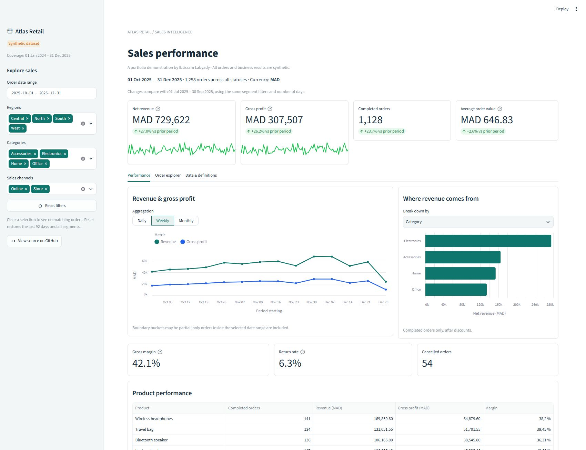
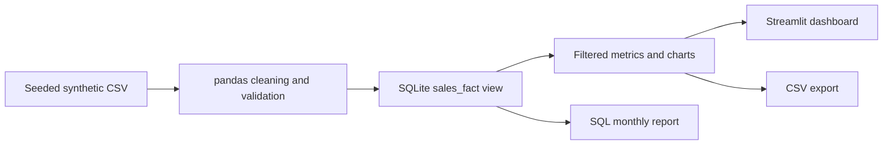

# Atlas Retail — Sales Analytics Dashboard

**A working Python + SQL portfolio demo for exploring sales, margins, and returns.**


> **v0.1 · Local application · Synthetic data.** The dashboard, cleaning logic,
> SQL transformations, CSV export, and automated tests are implemented. This is
> a personal portfolio demonstration, not a client engagement or a production system.
> A native Power BI report and public hosting are still planned.



## Overview

Atlas Retail is a fictional retailer used to demonstrate a complete analytical
workflow: define the business question, validate raw orders, calculate consistent
metrics, and make the results explorable. The application includes **7,806 unique
synthetic orders** covering January 2024 through December 2025.

The default view shows Q4 2025. Change the sidebar filters to explore revenue,
gross profit, product performance, and order outcomes across regions and channels.

## Business Problem

A retail manager receives sales extracts but needs answers to three questions:

1. How are revenue and gross profit changing over time?
2. Which products, categories, regions, and channels contribute the most?
3. How do discounts, returns, and cancelled orders affect the reported metrics?

Without consistent definitions, duplicate rows and excluded-order rules can
produce conflicting reports. This demonstration makes those definitions visible
and traceable to the code.

## Objectives

- Deliver an interactive dashboard that can be run from a fresh checkout.
- Make data cleaning and metric calculations reproducible.
- Apply the same filters to charts, KPIs, comparisons, and exports.
- Document assumptions and validate edge cases with automated tests.

## Tech Stack

| Layer | Implemented technology | Purpose |
| --- | --- | --- |
| Data preparation | Python, pandas | Normalize, deduplicate, and validate orders |
| Analytical model | SQLite, SQL | Calculate recognized revenue, cost, profit, and monthly aggregates |
| Interface | Streamlit | Filters, KPI cards, data explorer, and export |
| Charts | Altair | Time series and segment comparisons |
| Verification | unittest, Streamlit AppTest | Calculation and interface behavior tests |
| Version control | Git, GitHub | Source, documentation, and test workflow |

Dependency versions are pinned in [requirements.txt](requirements.txt). SQLite is
included with Python. No API key, paid service, or external database is required.
**Power BI is a roadmap item; no `.pbix` file is included in this version.**

## Architecture/Workflow



Text is trimmed, exact duplicate rows are removed, and invalid values fail
validation. SQL applies the recognition rules using integer centimes. Completed
orders contribute revenue after discounts; cancelled and fully returned orders
contribute zero. The application creates its SQLite database in memory.

Read the [metric definitions](docs/metric-definitions.md) and
[dataset documentation](data/README.md) for formulas, schema, and limitations.

## Project Structure

```text
data-analysis-dashboard/
├── streamlit_app.py          # Dashboard entry point
├── requirements.txt         # Pinned runtime dependencies
├── .streamlit/config.toml    # Native theme
├── data/
│   ├── sales_raw.csv        # Committed synthetic data
│   └── README.md            # Provenance and data dictionary
├── src/analytics.py          # Cleaning, filters, and calculations
├── sql/
│   ├── sales_fact.sql       # Executed analytical view
│   └── monthly_sales.sql    # Parameterized report query
├── scripts/
│   ├── generate_data.py     # Deterministic data generation
│   └── build_report.py      # SQL report and findings export
├── tests/                   # Calculation and AppTest checks
├── docs/
│   ├── metric-definitions.md
│   ├── demo-findings.md
│   ├── upwork-portfolio.md
│   └── screenshots/dashboard.png
└── .github/workflows/tests.yml
```

`output/` is created locally by the report command and is excluded from Git.

## Features

**Implemented**

- Inclusive date-range filters plus region, category, and channel selectors.
- Net revenue, gross profit, completed orders, average order value, gross margin,
  return rate, and cancelled-order counts.
- Comparison with the immediately preceding period of equal length, using the
  same filters; unavailable baselines are not shown as misleading percentages.
- Daily, weekly, and monthly revenue/profit charts.
- Revenue breakdown by category, region, or channel and product-level analysis.
- Order explorer with filtered CSV download.
- Visible source quality summary and metric definitions.
- Empty-selection handling, filter reset, and 14 automated tests.

**Planned:** public hosting, a real public dataset, a native Power BI report,
and controlled CSV upload. Forecasting and production integrations are outside
the current MVP.

## Getting Started

Use **Python 3.11 or later**. This version was tested locally with Python 3.14.
Run commands from the repository root.

```bash
git clone https://github.com/ibtissamlabyady/data-analysis-dashboard.git
cd data-analysis-dashboard
python -m venv .venv
```

**Windows PowerShell** (activation is not required):

```powershell
.\.venv\Scripts\python.exe -m pip install -r requirements.txt
.\.venv\Scripts\python.exe -m streamlit run streamlit_app.py
```

**macOS / Linux:**

```bash
source .venv/bin/activate
python -m pip install -r requirements.txt
python -m streamlit run streamlit_app.py
```

Open the local URL printed by Streamlit, normally `http://localhost:8501`.
The committed dataset is ready to use; generating it is optional.

For the commands below, use your virtual environment's Python. On Windows,
replace `python` with `.\.venv\Scripts\python.exe`.

```bash
# Verify calculations and UI behavior
python -m unittest discover -s tests -v

# Export clean data, a monthly SQL report, and a findings note
python -m scripts.build_report

# Optional: regenerate the synthetic source CSV (overwrites the demo file)
python -m scripts.generate_data
```

The report command writes `output/sales_clean.csv`, `output/monthly_sales_2025.csv`,
and `docs/demo-findings.md`. Test coverage includes returns/cancellations, weighted
margin, rounding, invalid records, date boundaries, empty filters, and reset behavior.

## Results/Expected Outcomes

**Verified technical results:** 7,824 raw rows become 7,806 validated orders;
18 exact duplicates are removed and 100 text cells are trimmed. All 14 local
automated tests pass.

**Sample findings for calendar year 2025, all segments:**

| Metric | Generated sample result |
| --- | ---: |
| Net revenue | MAD 2,443,505.90 |
| Gross profit | MAD 1,030,655.90 |
| Completed orders | 3,828 |
| Gross margin | 42.18% |

These figures are reproducible outputs from fictional data, not achieved client
results. Seasonal growth is programmed into the generator. The
[findings report](docs/demo-findings.md) explains interpretation limits.

The intended business use is consistent reporting and faster exploration of sales
questions. No actual time savings or commercial impact have been measured.

## Screenshots

The image at the top is an **actual capture of the running Streamlit application**,
using Q4 2025 and all segments. It is stored in
[docs/screenshots/dashboard.png](docs/screenshots/dashboard.png).
The annual results above use a different date range, so their totals differ.

## Roadmap

- [x] Define business questions, metrics, and data rules.
- [x] Create a reproducible synthetic dataset with documented provenance.
- [x] Implement Python cleaning and SQL transformations.
- [x] Build dashboard filters, charts, comparisons, and export.
- [x] Verify calculations and filter behavior with automated tests.
- [x] Publish actual screenshots, setup instructions, and findings.
- [ ] Add a real public dataset and document its license and limitations.
- [ ] Build a Power BI version with a documented model and measures.
- [ ] Add controlled CSV upload with schema guidance.
- [ ] Deploy a public demo and add the verified URL here.

## Author

**Ibtissam Labyady** — Data Analyst / Data Engineer portfolio.

[GitHub](https://github.com/ibtissamlabyady) ·
[Upwork](https://www.upwork.com/freelancers/~01c76285652a997502) ·
[LinkedIn](https://www.linkedin.com/in/ibtissam-labyady/)

[Portfolio presentation text](docs/upwork-portfolio.md) is included for describing
this project on Upwork.
